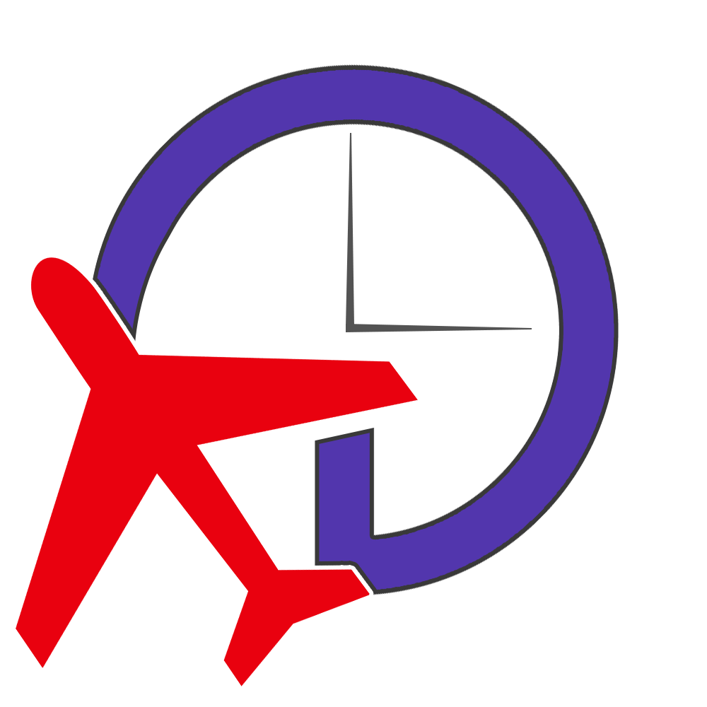

<h3 align="center">FS Time Sync</h3>

**No Fuzz Time Syncronization for Flight Simulators**

<a href="https://github.com/shotwn/FS-Time-Sync/issues">Report Bug</a>
·
<a href="https://github.com/shotwn/FS-Time-Sync/releases">Download</a>
.
<a href="https://github.com/shotwn/FS-Time-Sync/issues">Request Feature</a>
.
<a href="https://www.patreon.com/shotwn">Support</a>

### Icons
https://material.io/resources/icons/